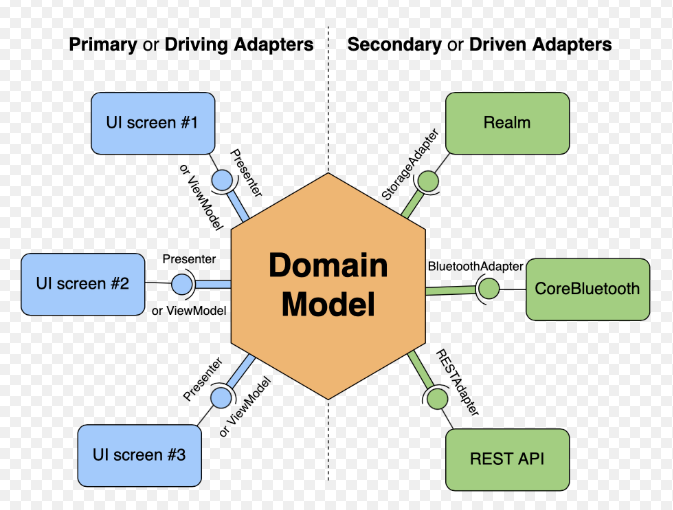

# HexaTuist

Monorepo iOS + iPadOS + macOS built with **Tuist** and **Hexagonal Architecture (Ports & Adapters)**, modularized by feature and ready for **white‑label products**.

## Products (White‑Label)

1. **CommercePro**
   - iOS+iPad: `com.mycompany.commercepro.ios`
   - macOS: `com.mycompany.commercepro.macos`
   - Features: Catalog, Cart, Checkout, Payments

2. **CommerceLite**
   - iOS+iPad: `com.mycompany.commercelite.ios`
   - macOS: `com.mycompany.commercelite.macos`
   - Features: Catalog, Cart, Checkout

## Architecture

Each feature is split into 4 targets (hexagonal):

- `<Feature>Domain` — pure domain (entities, rules)
- `<Feature>Application` — use cases + ports (protocols)
- `<Feature>Infrastructure` — adapters (mock/local/network)
- `<Feature>Presentation` — ViewModels and mappers (no Views)

Apps contain SwiftUI Views + Composition Root (dependency injection).

Shared modules:

- `SharedDomain` — Money, CurrencyCode, typed IDs, DomainError
- `ProductKit` — reads `APP_PRODUCT` from Info.plist and exposes `ProductContext`

## Repo Layout

```
Apps/
  CommercePro-iOS/
  CommercePro-macOS/
  CommerceLite-iOS/
  CommerceLite-macOS/
Features/
  Catalog/
  Cart/
  Checkout/
  Payments/
Shared/
  SharedDomain/
  ProductKit/
Tuist/
Workspace.swift
Tuist.swift
```

## Quick Start

```sh
tuist generate
```

Open `HexaTuist.xcworkspace` and run any app scheme:

- `CommercePro-iOS-commercePro`
- `CommercePro-macOS-commercePro`
- `CommerceLite-iOS-commerceLite`
- `CommerceLite-macOS-commerceLite`

## Notes

- Xcode projects are **generated** by Tuist and are not committed.
- All targets explicitly set deployment targets to avoid mismatches.
- iOS uses `NavigationView` for iOS 15 compatibility.

## Tutorial

See `TUIST_TUTORIAL.md` for the full setup walkthrough and common fixes.

## More about Tuist

Learn more at:

```
https://tuist.dev
```

## Reference Diagram (Clean Architecture)


